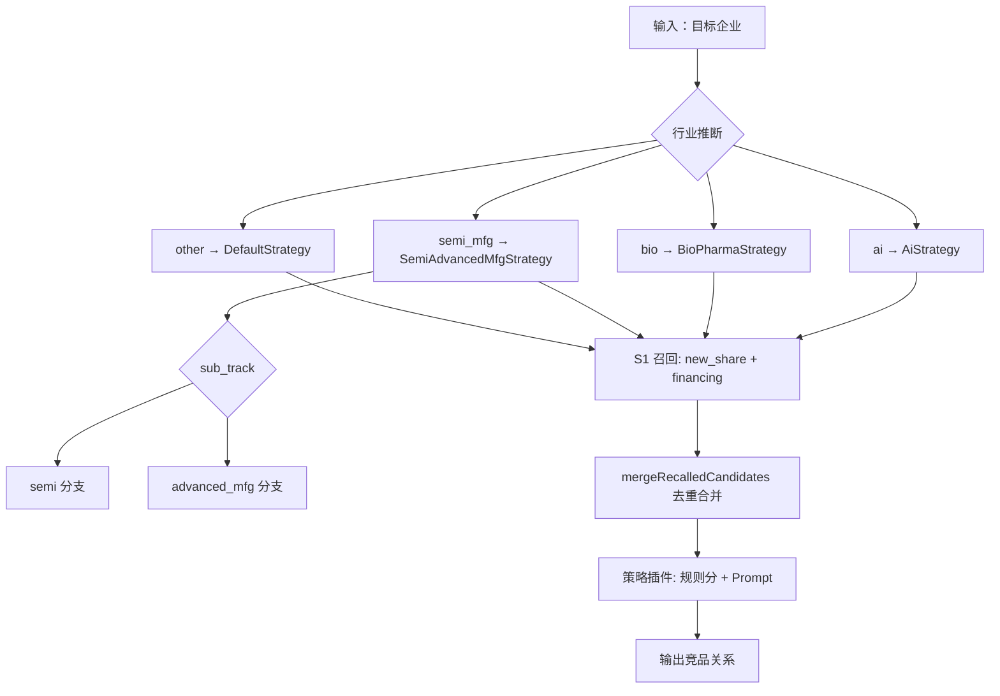

# 竞品分析优化改进 2.0 需求

| 项目 | 说明 |
|------|------|
| 文档版本 | v3.0（实施完成） |
| 创建日期 | 2026-06-30 |
| 最后更新 | 2026-07-25 |
| 状态 | **Stage 0–4 全部完成并验证通过**；灰度开关已激活 |
| 关联模块 | 竞品分析、项目挖掘（融资时间）、投前项目、打新日历（上市进展） |
| 首期行业范围 | 人工智能、生物医药、半导体、先进制造（L3：`semi_mfg` 合并策略，**内部分轨可拆分**） |

---

## 0. 实施优先级（总原则）

**先底座、后策略**：必须完成基础数据初始化与补全，再启动竞品分析引擎（L3）改造。

```
Stage 0  摸底 + 门禁（百科/东财/L1 归并/金标准）  ← 不过门禁不启动 Stage 1 全量
    ↓
Stage 1  上市主数据（ipo_new_share）
    ↓
Stage 2  融资池 + 投前 pipeline
    ↓
Stage 3  优先行业批 structured
    ↓
Stage 4  竞品 L3（灰度 / 可回滚）
```

竞品分析跑批在 Stage 1–3 未达标前**不切换**新召回源；Stage 4 必须通过配置开关灰度，**禁止一次性硬切**。

---

## 1. 背景与问题

（略，同 v2.0：融资 AI 偏差、ipo 池过小、new_share 全称 3.2%、融资池 42 万事件等。）

### 1.2 现状摘要（代码基线 + 库内规模 2026-06-30）

| 环节 | 当前实现 | 主要局限 |
|------|----------|----------|
| 上市召回 | `recallFromIpoProjects` → `ipo_project` | 仅 ~1,361 条竞品应用数据，非全市场 |
| 打新日历 | `ipo_new_share`，AkShare/东财同步 | 无申万行业；全称 **154/4773（3.2%）** |
| 融资/投前取数 | LLM 联网为主 | 单一来源、幻觉；上市主体重复 enrich |
| 行业字段 | 融资有 `industry_source_lv1`（烯牛） | **不使用** `industry_std_lv1` |
| 竞品引擎 | 通用规则 + bio 硬编码 | 待 Stage 4 再改 |

**融资信用代码（参考）**：去重企业约 24.8 万，与「有信用代码的去重键」数量一致，**关联键以信用代码为主可行**；Stage 0 仍须统计**事件级**填充率与 new_share JOIN 成功率。

---

## 2. 目标与非目标

### 2.1 目标

1. **Stage 0**：门禁摸底（百科覆盖率、东财 500 条、L1 归并、金标准样本、百科接入 PoC）。
2. **Stage 1**：`ipo_new_share` 上市主数据（分阶段验收，非一次性 90%）。
3. **Stage 2**：融资池 + **投前 pipeline 专节**；已上市从 new_share 同步。
4. **Stage 3**：优先行业批 structured。
5. **Stage 4**：`ipo_new_share` 主召回 + 灰度 / 回滚 + A/B。

### 2.2 非目标

- 新建 `company_profile_cache` 等企业级 cache 表。
- Stage 0 门禁未过即启动 Stage 1 全量百科/画像批跑。
- Stage 4 无开关硬切召回源。

---

## 3. 总体方案：三层架构 + 双轨主数据

```
上市主档 ipo_new_share：东财/AkShare → 企查查 → 申万 │ 百科（Stage 0 定优先级）│ LLM
融资 private：百科 → LLM（无词条降级见 §6.6）
融资 listed / 投前已上市：从 new_share 同步
投前：BP → 百科 → LLM（见 §5.6）
```

---

## 4. Stage 0：摸底与门禁（约 1 周，**阻塞后续全量**）

### 4.1 前 2 个工作日（优先）

| 序号 | 任务 | 产出 |
|------|------|------|
| 0-1 | 导出 `industry_source_lv1` **去重清单** + 业务归并四大类 | 《四大类归并规则》+ `industry_source_l1_map` 配置表 |
| 0-2 | 边界案例书面确认 | 见 **§4.1.2**；遗留项：`sub_track` 二级规则（L3 层，不影响大类归属） |
| 0-3 | 统计 `company_credit_code` **事件级/企业级**非空率 | 报表 |
| 0-4 | 启动**金标准样本**标注 | 见 **§4.1.1**；**暂缓**，待竞品功能完成后用案例企业跑测评 |
| 0-5 | 导出 **`ipo_new_share` 申万行业填充率基线**（当前库内应为 **0%**，Stage 1a 后对比） | 基线报表 |
| 0-6 | **优先行业批百科命中率抽样**（去重企业，分 category_4） | 命中率报表（与 §4.3 合并验收） |

> L1 若仅数十个标签：1–2 人日；若上百且边界模糊：预留 **3–5 人日**业务评审。

#### 4.1.1 金标准标注（跨团队约定，**暂缓至功能完成后**）

> **当前决策（2026-07-01）**：Stage 0 **暂不开展**人工金标准标注。待竞品分析功能（Stage 4 引擎 + 案例企业跑批）就绪后，以**案例企业**实际跑出的目标–候选对做测评，再补全金标准与 1.0 基线分。  
> 基础设施已预留：`competitor_gold_standard_pair` 表、[金标准标注模板.csv](./金标准标注模板.csv)（90 个目标企业骨架，候选与标注待后补）。

| 项 | 约定 |
|----|------|
| 规模 | **30 条 / 行业 × 4 类**（ai / bio / semi_mfg / other 可先只做前三类） |
| 标注 | **3 人独立标注**「是否竞品 + 竞品类型」；不一致由业务仲裁 |
| 内容 | 目标企业 + 候选企业对；覆盖 new_share / financing 各至少 30% |
| 用途 | Stage 4 测召回与 L3；记录 **1.0 基线分** 后再比 +15pp |
| 触发时机 | **竞品功能完成 + 案例企业跑批有结果后**，再导出/标注 |
| 存储 | `competitor_gold_standard_pair` 表或 CSV（路径已定） |

#### 4.1.2 烯牛 L1/L2 → category_4 归并规则（业务已定稿）

> **参考文件**：[行业分类映射.xlsx](./行业分类映射.xlsx)（一级/二级行业 → 映射分类，共 269 行）  
> **状态**：L1 主映射 **已确认**；`industry_source_l1_map` **已导入**（116 行）；覆盖率见 [库内行业映射覆盖率报告.md](./库内行业映射覆盖率报告.md)。

**业务展示名 ↔ 系统 `category_4`**：

| 业务映射分类（展示名，= xlsx「映射分类」列） | `category_4`（系统枚举） | L3 策略 |
|---------------------------------------------|---------------------------|---------|
| 数字智能 | `ai` | `AiStrategy` |
| 半导体&先进制造 | `semi_mfg` | `SemiAdvancedMfgStrategy` |
| 生物医药 | `bio` | `BioPharmaStrategy` |
| （空） | `other` | `DefaultStrategy` |

> **与 Excel 对齐**：xlsx「映射分类」列**仅 3 个行业标签**——`数字智能`、`半导体&先进制造`、`生物医药`。其中制造/半导体相关行（先进制造、新能源、智能硬件、汽车出行、传统制造及其全部二级行业）的映射分类**统一填写「半导体&先进制造」**，不存在单独的「半导体」或「先进制造」映射标签。  
> **命名说明**：「半导体&先进制造」是**一个**业务大类名；烯牛一级行业名（如「先进制造」）写在「一级行业」列，映射分类列仍填「半导体&先进制造」→ 系统 `semi_mfg`。

**已映射一级行业（xlsx 共 14 个）**：

| xlsx「映射分类」 | `category_4` | 烯牛「一级行业」 |
|------------------|--------------|------------------|
| 数字智能 | `ai` | 人工智能、VRAR、企业服务、区块链、大数据、物联网、通信业务 |
| 半导体&先进制造 | `semi_mfg` | 先进制造、新能源、智能硬件、汽车出行、传统制造 |
| 生物医药 | `bio` | 医疗、化学工业 |

- 上表各 L1 下**全部二级行业**的「映射分类」与 L1 **相同**（xlsx 已逐行标注，无 L2 例外）。
- **库内扩展**：烯牛若出现一级行业「半导体」，「映射分类」**同样**填「半导体&先进制造」→ `semi_mfg`（与 Excel 标签一致；xlsx 当前无单独行，导入配置表时按同规则补全）。
- **已决议边界**：智能硬件 → `semi_mfg`；医疗（含医疗器械等 L2）→ `bio`。

**未映射一级行业（16 个）→ `other`**：

体育、公用事业、农业、工具类、建筑业、房地产、教育、文娱传媒、旅游、消费、物流运输、生活服务、电商零售、石油矿采、社交、金融

**待确认（仅 L3 子轨，不影响大类）**：

| 项 | 说明 |
|----|------|
| **`sub_track` 二级规则** | 映射大类已到 `category_4`；`semi_mfg` 内 `semi` / `advanced_mfg` 按 L1 + 申万 + tags 推断：**半导体** L1 → `sub_track=semi`；先进制造、新能源、智能硬件、汽车出行、传统制造 → `advanced_mfg`（§7.2） |
| 库内覆盖率 | 导入后须统计：融资事件 `industry_source_lv1` 命中映射表比例、未命中清单 |

**配置表字段约定**（`industry_source_l1_map`）：

| 字段 | 示例 |
|------|------|
| `source_lv1` | 人工智能 |
| `source_lv2` | （空表示 L1 级默认；非空表示 L2 覆盖，本期无例外可留空） |
| `category_4` | ai |
| `category_display` | 数字智能 / 半导体&先进制造 / 生物医药（**与 xlsx「映射分类」列逐字一致**） |
| `sub_track` | semi / advanced_mfg（可选，仅 semi_mfg） |
| `boundary_note` | |
| `confirmed_by` | 业务负责人 |

### 4.2 东财/AkShare 小批量验证（全称补全）

- 分层抽样 **500 条** `ipo_new_share`（沪/深/北/港股各一段）。
- 跑东财/AkShare 回填 **企业全称 + 信用代码**，记录分板块回填率。
- **门禁**：若东财覆盖率低于预期（尤其北交所、老三板），Stage 1 必须启用 **企查查第二源**，并修订 Stage 1 工期（+3–5 人日）。

### 4.3 百科 PoC（**最大外部依赖，Stage 0 必过**）

在 **优先行业批**（近 3 年融资去重企业）上验证：

| 验证项 | 说明 |
|--------|------|
| 词条覆盖率 | 分 category_4 统计有/无词条比例 |
| 接入方式可持续性 | **D8 已定稿：百度百科可控爬虫**（`baidu_baike_fetch.py`） |
| 结构化质量 | 抽样 ≥30 家/类：百科 vs 现 AI vs 业务主观 |

**D8 定稿（2026-07-01）**：

| 项 | 结论 |
|----|------|
| 接入方式 | 百度百科 **爬虫**（非第三方 API） |
| 脚本 | `news/server/utils/project-sourcing/baidu_baike_fetch.py`（HTTP）；**本机 PoC** 用 `baidu_baike_fetch_browser.py`（Playwright CDP） |
| 编排 | `node server/scripts/runBaikePoc.js`（`npm run poc:baike`）；浏览器模式：`npm run poc:baike:browser`（先 `server/scripts/startChromeForBaike.ps1`） |
| 抓取字段 | `company_intro`（企业介绍）、`product_intro`（产品介绍/主营业务段落） |
| 降级规则 | **无独立产品介绍时，`product_intro` = `company_intro`** |
| 频率 | 默认 `--sleep-ms=1200`，全量批处理须遵守 |
| 失败分类 | `miss_reason`：**`no_lemma`**（页面确认无词条）vs **`anti_crawl`**（安全验证/反爬，词条是否存在**未知**）；不可将后者计入无词条率 |

**门禁规则**：

- 百科 PoC 报告产出且 **D8 定稿**、脚本可重复跑通 → 才启动 Stage 1/2 **全量**百科查词。
- 若覆盖率低于预期：百科降为 **P1**（非 P0），Stage 1 上市画像增加 **东财/申万公司简介** 作为主源之一；「无词条→LLM」按 §6.6 执行。

### 4.4 已上市关联摸底

- 规则识别 IPO 类轮次企业（库内实测去重 **13,755**，事件 **36,044**；文档参考 ~1.48 万为早期估算）。
- 按 **§5.3.1 关联优先级** 与 `ipo_new_share` JOIN，统计成功率、`listing_status=unknown` 占比。
- 产出：[listed_JOIN摸底报告.md](./listed_JOIN摸底报告.md)（脚本 `npm run report:listed-join`，规则实现 `listedFinancingJoin.js`）。
- 输出 Stage 2 `syncListedFinancingFromNewShare` 预期工作量。

### 4.5 Stage 0 出口 checklist

- [x] `industry_source_l1_map` 已发布（**映射规则 §4.1.2，xlsx 已导入 116 行**；待业务签字）
- [x] 库内行业映射覆盖率报告（§4.1.2 / [库内行业映射覆盖率报告.md](./库内行业映射覆盖率报告.md)）
- [x] 东财 500 条回填率报告（[东财500条回填率报告.md](./东财500条回填率报告.md)；需 `py` 启动器）
- [x] 百科覆盖率 + 接入方式 D8 定稿（爬虫方案；**已执行** `npm run poc:baike` → [百科PoC命中率报告.md](./百科PoC命中率报告.md)，2026-07-01）
- [x] 信用代码填充率 + listed JOIN 率（信用代码见 [库内行业映射覆盖率报告.md](./库内行业映射覆盖率报告.md)；listed JOIN 见 [listed_JOIN摸底报告.md](./listed_JOIN摸底报告.md)，2026-07-01）
- [ ] 金标准标注（**暂缓** → Stage 4 功能 + 案例企业测评后再做；表/CSV 骨架已备）
- [x] **`ipo_new_share` 申万填充率基线**已导出（[ipo_new_share字段基线报告.md](./ipo_new_share字段基线报告.md)）
- [x] 优先行业批 **百科命中率抽样**报告（见百科 PoC 报告）
- [x] Stage 1–4 **分阶段**验收指标写入本文档 §9（**v3.0 补全实际达成数据**）

### 4.6 配置与 schema 冻结（Stage 0 末，**阻塞 Stage 1 建表**）

字段 DDL 发布前须书面确认：

#### 4.6.1 `industry_category_4` 映射配置

| 项 | **建议定稿（采纳跨团队建议）** |
|----|-------------------------------|
| 存储 | **MySQL 表** `industry_source_l1_map`（与 `industry_source_lv1` 烯牛 L1 对齐） |
| 字段 | `source_lv1`, `category_4`, `sub_track`（可选）, `boundary_note`, `confirmed_by`, `F_LastModifyTime` |
| 维护 | **业务负责人**维护映射与边界；研发提供导入脚本 + 管理 API（或首期 Excel 导入） |
| 申万→四大类 | 另表或同表扩展：`sw_industry_l1/l2 → category_4, sub_track`（上市侧 Stage 1c 使用） |
| 不推荐 | 仅 JSON 文件（多环境同步与审计差）；若 Stage 0 赶工可 **JSON 种子 + 首版迁 MySQL** |

#### 4.6.2 L2 `structured_profile_json` 值域

- Stage 0 产出 **《structured_profile 值域说明》**（JSON Schema 或表格）：各 `category_4` / `sub_track` 下字段 **枚举值、必填/可选、最大长度**。
- 示例：`bio.value_chain` ∈ {创新药, CXO, 器械, …}；`semi.chain_position` ∈ {设计, 制造, 封测, 设备, 材料, EDA, IP}。
- Prompt 与校验代码 **共用同一份 schema 版本号**（如 `structured_schema_v1`）。

---

## 5. Stage 1：上市主数据（`ipo_new_share`）

### 5.1 定位

| 表 | 角色 |
|----|------|
| **`ipo_new_share`** | **境内沪深北上市主档**（Stage 1 扩至现行约 **5,532** 家；当前库内 ~4,7xx，以打新/东财同步为种子，**不以融资池为规模口径**） |
| **`ipo_project`** | 基金底层项目，**非**全市场上市池 |

### 5.2 字段扩展

（同 v2.0：`unified_credit_code`、`sw_industry_*`、`industry_category_4`、`product_intro`、标签、`profile_source`、`baike_*`、`structured_profile_json` 等。）

### 5.3 初始化步骤（分阶段）

| 子阶段 | 内容 | 数据源优先级 |
|--------|------|--------------|
| **1a** | 爬虫扩展：申万行业落库 | 东财/AkShare |
| **1b** | 全称 + 信用代码补全 | **东财/AkShare → 企查查（按代码/名称）→ 现有 AI 全称补齐** |
| **1c** | 四大类 `industry_category_4` | 申万 + 映射表 |
| **1d** | 企业介绍 / 产品简介 / 标签 | **申万/东财简介 + 百科（若 Stage 0 通过）→ LLM**；不单押百科 |

### 5.4 验收（分阶段，避免一次性 90% 乐观目标）

| 阶段 | 指标 | 目标 |
|------|------|------|
| **1b 后** | 全称或信用代码可关联 | **≥ Stage 0 东财 500 条实测率 × 0.9**（由摸底填具体数字，示例 70%–85%） |
| **1b+企查查后** | 同上 | **≥ 85%**（4773 基数） |
| **1a 后** | 申万行业非空 | ≥ 95%（北交所/特殊板块允许 documented 例外清单） |
| **1c 后** | 四大类已标注 | 100% |
| **1d 后** | 有效 `product_intro` | ≥ 80%（可先 **四大类子集** 100% 再扩全量） |
| **stretch** | 全称+代码可关联 | 90%（全源补完后评估，非 Stage 1 首日硬门禁） |

#### 5.4.1 实际完成情况（2026-07-25 完成）

| 子阶段 | 结果 | 说明 |
|--------|------|------|
| 1a 申万行业 | **达标** | `ipo_new_share` 申万行业填充率 **99.2%**（5,541/5,586） |
| 1b 全称+信用代码 | **达标** | 全称填充率 **99.2%**，信用代码 **99.2%** |
| 1c 四大类标注 | **达标** | 通过申万 + 映射表自动推断，覆盖率与申万一致 |
| 1d 百科查词 | **达标** | 5,624 条记录，查得率 **95.7%**；`product_intro` 有效填充率 **59.5%**（≥40字） |
| 百科批处理 | 单进程稳定 | `backfillNewShareBaikeBrowser.js`，Playwright CDP + domcontentloaded + 验证码停留轮询 |

---

## 6. Stage 2：融资池画像与上市识别

### 6.1 行业：`industry_source_lv1` + 映射表

- **不用** `industry_std_lv1`。
- 映射表 Stage 0 前 2 天完成（见 §4.1）。
- 配置表：`industry_source_l1_map(source_lv1 → category_4)`，附边界规则说明。

### 6.2 数据源优先级（分场景）

| 场景 | 优先级 |
|------|--------|
| **投前** | 见 **§6.5** |
| **融资·非上市** | 百科 → LLM（§6.6 无词条降级） |
| **融资·已上市** | `ipo_new_share` 同步，不重复百科/LLM 主路径 |

### 6.3 已上市识别与关联

**识别（无 LLM）**：`round` / `latest_round` 命中 IPO、上市、定增、Post-IPO 等 → **仅用于从融资池筛候选**，**不能**单独认定「现行 A 股上市」。

**上市真值**：以 `ipo_new_share` **沪深北在册**为准（Stage 1 对齐东财全量 ~5,532；含退市前主体由同步策略定义）。融资 IPO 类中大量为境外、已退市或未入库噪声。

**关联优先级（§5.3.1，禁止仅 fuzzy 名称静默关联）**：

```
1. company_credit_code = ipo_new_share.unified_credit_code     （首选）
2. 融资侧已有 listed_stock_code 与 new_share.stock_code 一致
3. 规范化全称 exact match（去「股份有限公司」等后缀）
4. 名称 fuzzy → listing_status=unknown，进二次匹配队列（规则 + 人工）
5. 禁止：低置信 fuzzy 直接 listed 或触发 LLM「猜关联」
```

**字段**：`listing_status`、`listed_stock_code`、`listed_exchange`、`profile_source=listed_sync` 等（同 v2.0）。

**unknown 队列**：运营/脚本定期处理；不堆积到 LLM。

### 6.4 处理范围

| 步骤 | 范围 |
|------|------|
| ① 百科查词 | 融资全量企业去重（**Stage 0 百科门禁通过后**） |
| ②③ structured | 优先行业批 × 近 3 年 |
| 已上市同步 | IPO 类轮次 + 关联成功子集 |

### 6.5 投前 pipeline（专节，Stage 2 实施前设计评审）

| 环节 | 规则 |
|------|------|
| **优先级** | BP 提取 → 百度百科 → LLM |
| **BP 与百科匹配** | 以 `unified_credit_code` 锁定主体；百科检索词用企查查/档案 **现用全称** + 项目简称 |
| **BP 内行业信息** | 写入 tags 或 `structured_profile_json` 草稿，**参与 `category_4` 推断**，不丢弃 |
| **跨表复用** | 同信用代码在融资池或 new_share 已有 `profile_version` 新且 `profile_confidence ≥ 阈值` → **跳过**百科/LLM，fan-out 更新投前表 |
| **已上市投前标的** | 若可关联 new_share → 走 **listed 同步**，不走私募百科链 |
| **readiness** | 企查查 +（BP 或 百科 或 structured 或 融资/new_share donor 任一有效） |
| **与 BP 提取冲突** | BP 产品简介优先于百科；百科可补 BP 未覆盖的标签/行业 |

### 6.6 百科无词条降级（非上市 / 投前）

| 项 | 设计 |
|----|------|
| Prompt | **独立模板**「无百科联网 enrich」，与「有百科结构化抽取」分离 |
| `profile_source` | `llm_web` |
| `profile_confidence` | 默认 ≤ 0.55；列表/详情可标「低置信」 |
| 人工抽检 | 每批 enrich **≥ 5%** 或每行业 **≥ 30 条** |
| 禁止 | 无百科时仍用「结构化抽取」prompt 假装有锚点 |

### 6.7 批处理脚本（融资 / 上市，**与投前分离**）

| 脚本 | 目标表 | 范围 |
|------|--------|------|
| `backfillNewShareListedProfile.js` | `ipo_new_share` | Stage 1 上市主数据 |
| `backfillFinancingBaikeLookup.js` | `sourcing_financing_event` | ① 融资全池百科查词 |
| `syncListedFinancingFromNewShare.js` | `sourcing_financing_event` | 已上市同步 |
| `backfillFinancingProfileEnrich.js` | `sourcing_financing_event` | ②③ 优先行业批 structured |

**不与融资混跑**：投前独立脚本与队列（见 §6.8）。

### 6.8 投前批处理范围（`pre_investment_project`，**独立 pipeline**）

| 步骤 | 脚本/服务（建议命名） | 范围 | 说明 |
|------|----------------------|------|------|
| BP 提取 | 现有 `extractBpForProject` / `bpFileParser` | 有 BP 的投前记录 | 优先写 `product_intro`、tags、`profile_source=bp` |
| 百科查词 | `backfillPreInvestmentBaikeLookup.js` | **全部**未删除投前项目（或按创建时间近 2 年） | **不写入融资表**；结果写投前表 `baike_*` |
| 画像 enrich | `backfillPreInvestmentProfileEnrich.js` | 无 BP 且无百科 → LLM；有 donor 则跳过 | 复用 §6.5 跨表 donor 规则 |
| structured | `backfillPreInvestmentStructured.js` | **优先行业批**内投前项目（按映射表 + 近 2 年） | Stage 3；读 `structured_schema_v1` |

**原则**：投前 API、日志、批处理队列与 `financingAiEnrichService` **分开**；仅 **donor 只读** 融资池 / new_share 已有画像。

```bash
node server/scripts/backfillPreInvestmentBaikeLookup.js --dry-run
node server/scripts/backfillPreInvestmentProfileEnrich.js --category=ai,bio,semi_mfg
node server/scripts/backfillPreInvestmentStructured.js --category=ai,bio,semi_mfg
```

#### 6.9 实际完成情况（2026-07-25 完成）

| 步骤 | 结果 | 说明 |
|------|------|------|
| 融资百科查词 | **完成** | `backfillFinancingBaikeLookup.js` 全池查词完成 |
| 融资画像 enrich | **完成** | `backfillFinancingProfileEnrich.js` 优先行业批 structured 完成 |
| 已上市同步 | **完成** | `syncListedFinancingFromNewShare.js` 从 `ipo_new_share` 同步已上市融资事件画像 |
| 投前百科查词 | **完成** | `backfillPreInvestmentBaikeLookup.js` 投前项目百科查词完成 |
| 投前画像 enrich | **完成** | `backfillPreInvestmentProfileEnrich.js` 投前项目画像补全 |
| 投前 structured | **完成** | `backfillPreInvestmentStructured.js` 优先行业批投前项目结构化完成 |

> **Pipeline 顺序**：Stage 0 → 1 → 2 → 3 → 4，各阶段串行执行，单进程批处理避免百科反爬。

---

## 7. Stage 3：L2 structured（优先行业批）

### 7.1 四大类与 L3 策略

> 完整链路（分赛道 → 召回 → 打分）见 **§7.4**。

| category_4 | L3 策略 | 备注 |
|------------|---------|------|
| `ai` | `AiStrategy` | |
| `bio` | `BioPharmaStrategy` | |
| `semi_mfg` | `SemiAdvancedMfgStrategy` | **合并策略**；schema 内 **可分子轨** |
| `other` | `DefaultStrategy` | Stage 4 前不扩改 |

### 7.2 `semi_mfg`：合并与可拆分设计

**映射层**：xlsx 中制造/半导体相关行的「映射分类」**均为「半导体&先进制造」**（一个业务标签 → `category_4=semi_mfg`）；烯牛一级行业名在「一级行业」列，与映射标签分列。

**structured / L3 层**：`structured_profile_json` 增加 **`sub_track`**：

| sub_track | 对标侧重 |
|-----------|----------|
| `semi` | 制程节点、Fabless/IDM、产品类别（存储/逻辑/模拟） |
| `advanced_mfg` | 工艺路线、下游应用、产能规模 |

- 推断规则：申万行业 + tags + 归并表（Stage 0 定义）。
- `SemiAdvancedMfgStrategy` **内部按 sub_track 分支**权重与 Prompt 附录，而非一套 prompt 硬套。

**拆分触发条件（预留，不写死合并）**：

- Stage 4 金标准验证 **「semi 设计 vs 设备误报 -20%」未达标**，或
- 业务评审认为 advanced_mfg 误报集中  
→ 拆为 `SemiStrategy` + `AdvancedMfgStrategy`；**仅增策略 registry**，不改 `category_4` 枚举。

### 7.3 结构化字段（摘要）

- **bio**：`value_chain`, `modality`, `process_stage`, `core_skus`, `customer_type`
- **ai**：`primary_product`, `delivery`, `target_customer`, `scale_signals`, `tech_stack`
- **semi**（sub_track=semi）：`chain_position`, `process_node`, `product_class`, `foundry_model`
- **advanced_mfg**（sub_track=advanced_mfg）：`process_route`, `downstream_application`, `capacity_scale`, `core_equipment`

### 7.4 不同赛道竞品选择逻辑（产品说明）

> **读者指引**：本节汇总「目标企业属于哪条赛道 → 从哪召回候选 → 用哪套策略打分」的完整链路，便于产品、业务与研发对齐理解。技术实现细节见 §8；行业映射配置见 §4.6.1、§12.4。

#### 7.4.1 总体原则

竞品选择**不走一套通用规则**，而是 **「先分赛道 → 再召回 → 再按策略打分」** 三层架构：

1. **分赛道**：将目标企业与候选企业归入 `category_4`（四大类），`semi_mfg` 可再细分为 `sub_track`。
2. **召回**：从上市主池 + 融资池拉取候选，按行业与画像字段做初筛。
3. **打分**：按赛道路由到对应 L3 策略插件，结合 structured 画像做规则分 + Prompt 语义对标。

```
目标企业 → 推断 category_4（+ sub_track）
         → S1 召回（上市池 + 融资池）
         → mergeRecalledCandidates 去重合并
         → 赛道策略插件（规则分 + Prompt）
         → 输出竞品关系
```

#### 7.4.2 赛道怎么定

**首期四大类**（`category_4`）：

| category_4 | 业务展示名 | L3 策略 | 备注 |
|------------|------------|---------|------|
| `ai` | 数字智能 | `AiStrategy` | L1：人工智能、VRAR、企业服务、区块链、大数据、物联网、通信业务 |
| `bio` | 生物医药 | `BioPharmaStrategy` | L1：医疗、化学工业；装备耗材硬约束仅在本赛道 Prompt |
| `semi_mfg` | 半导体&先进制造 | `SemiAdvancedMfgStrategy` | xlsx 映射分类均为「半导体&先进制造」；L1：先进制造、新能源、智能硬件、汽车出行、传统制造 |
| `other` | （其他） | `DefaultStrategy` | 未映射 L1 见 §4.1.2；Stage 4 前不做专项扩展 |

**映射来源**（业务已定稿，见 **§4.1.2**、[行业分类映射.xlsx](./行业分类映射.xlsx)）：

| 企业类型 | 原始行业字段 | 映射方式 |
|----------|--------------|----------|
| 融资 / 投前 | 烯牛 `industry_source_lv1`（及 L2） | `industry_source_l1_map` → `category_4`（可选 `sub_track`） |
| 上市 | 申万 `sw_industry_l1/l2` | 同映射表或扩展字段 → `category_4` |
| 遗留确认 | — | `sub_track` 二级规则见 §7.2（大类归属已齐） |

**`semi_mfg` 子轨**（structured / L3 层，不影响 `category_4` 枚举）：

| sub_track | 典型 L1 来源 | 对标侧重 |
|-----------|--------------|----------|
| `semi` | 半导体 | 制程节点、Fabless/IDM、产品类别（存储/逻辑/模拟） |
| `advanced_mfg` | 先进制造、传统制造、新能源、智能硬件、汽车出行 | 工艺路线、下游应用、产能规模 |

- 推断规则：申万行业 + tags + 归并表（§7.2）。
- 若金标准验证「semi 设计 vs 设备误报 -20%」未达标，可拆为独立策略类，**不改** `category_4`（§7.2）。

#### 7.4.3 竞品从哪召回

Stage 4 采用**方案 A**（§8.1），召回与赛道相关的范围约定如下：

| 召回池 | 数据源 | 角色 |
|--------|--------|------|
| **上市主池** | `ipo_new_share`（~4,773） | 全市场境内上市竞品，**主召回源** |
| **私募池** | `sourcing_financing_event` | 未上市 / 融资侧竞品 |
| **补充池** | `ipo_project` | 基金已投项目，可选补充 |

**优先行业批**（Stage 2/3 画像与 structured 的范围）= 四大类 × 近 3 年融资去重企业。L3 跑批前，优先行业批须完成 structured 补全（§6.4、§12.2）。

**双源命中同一企业时**（上市池 + 融资池），合并规则（§8.1.1）：

| 维度 | 规则 |
|------|------|
| 去重键 | `unified_credit_code` 优先，否则规范化 `display_name` |
| 行业字段 | 上市侧（`ipo_new_share`）申万 / `category_4` **优先保留** |
| 画像字段 | 按 `recallRichness` 富者覆盖 intro / tags |
| 融资补充 | 仅补 `financing_amount_text`、`latest_round`、`event_date` |
| 禁止 | 合并时丢弃 `is_listed` / `domestic_listed` 标记 |

#### 7.4.4 不同赛道怎么选（L3 策略路由）

召回完成后，按**目标企业**的 `category_4`（及 `semi_mfg` 的 `sub_track`）路由到 `industry-strategies/` 下对应策略：

| 赛道 | 策略类 | structured 对标字段（摘要） | 赛道特化 |
|------|--------|----------------------------|----------|
| `ai` | `AiStrategy` | `primary_product`, `delivery`, `target_customer`, `scale_signals`, `tech_stack` | — |
| `bio` | `BioPharmaStrategy` | `value_chain`, `modality`, `process_stage`, `core_skus`, `customer_type` | 装备耗材硬约束 |
| `semi_mfg` / `semi` | `SemiAdvancedMfgStrategy`（semi 分支） | `chain_position`, `process_node`, `product_class`, `foundry_model` | sub_track 分支权重与 Prompt |
| `semi_mfg` / `advanced_mfg` | `SemiAdvancedMfgStrategy`（advanced_mfg 分支） | `process_route`, `downstream_application`, `capacity_scale`, `core_equipment` | 同上 |
| `other` | `DefaultStrategy` | 通用 intro / tags | Stage 4 前不扩改 |

各策略内部执行：**规则分**（结构化字段匹配、硬约束）+ **Prompt 语义对标**（产品/客户/技术栈相似度），输出竞品类型与置信度。Prompt 与 structured 值域共用 `structured_schema_v1`（§4.6.2）。

#### 7.4.5 端到端流程



#### 7.4.6 设计要点与验收

| 要点 | 说明 |
|------|------|
| 赛道可配置 | 不由代码硬编码；`industry_source_l1_map` 由业务维护，边界规则 Stage 0 签字 |
| 召回与打分解耦 | 召回扩至全市场上市池；打分仍按赛道策略差异化 |
| semi_mfg 可演进 | 映射层合并、L3 层 `sub_track` 细分；不达标再拆策略类 |
| 质量按赛道验收 | 金标准 30 条/行业 × 3 人标注；semi 专项「设计 vs 设备误报 -20%」（§9.3） |
| 灰度可控 | `competitor_recall_source_config` 开关；先投前/单行业试运行（§8.3） |

---

## 8. Stage 4：L3 竞品引擎（灰度 + 可回滚）

### 8.1 召回（方案 A）

- 主上市池：`recallFromListedNewShare`
- 私募：`recallFromFinancingEvents`
- 补充：`ipo_project`（基金已投，可选）

### 8.1.1 双源去重与合并（new_share + financing）

同一企业在 **上市召回** 与 **融资召回** 均命中时，沿用并扩展现有 `mergeRecalledCandidates`（`competitorMatchRecall.js`）：

| 规则 | 说明 |
|------|------|
| **去重键** | `candidateDedupeKey`：优先 `unified_credit_code`，否则规范化 `display_name` |
| **sources** | 合并为 `sources: ['ipo_new_share', 'sourcing_financing_event']`（新源枚举 `ipo_new_share`，替代主路径上的 `ipo_project`） |
| **画像字段** | 比较 `recallRichness`（intro 长度×2 + tags 数×8 + qcc_intro）；**富者覆盖** intro/tags/qcc |
| **上市侧优先** | 若一方 `source=ipo_new_share` 且 `is_listed=true`，其 **`industry_l1/l2`（申万/category）优先保留**；融资侧仅补 `financing_amount_text`、`latest_round`、`event_date` |
| **冲突** | intro/tags  richness 相同时：**new_share 优先**（上市主档更新频率与申万行业更可信） |
| **event_date** | 取较晚者写入合并项（现有逻辑） |
| **禁止** | 双源合并时丢弃 `is_listed` / `domestic_listed` 标记 |

Stage 4 实现前在 `mergeRecalledCandidates` 单测或 POC 导出中验证 **重叠企业数** 与字段合并样例。

### 8.2 规则分 / Prompt / 策略插件

> 赛道选择与策略路由的产品说明见 **§7.4**。

- `industry-strategies/` 目录；`semi_mfg` 内 sub_track 分支。
- 装备耗材硬约束 **仅 bio** Prompt。
- **竞争透镜（competition_lens）**：见 **§8.5**。形态软匹配 / 召回词 / Prompt 优先认透镜，禁止仅靠 buzzword 抬分。

### 8.3 灰度、A/B 与回滚（**必做**）

| 机制 | 说明 |
|------|------|
| **配置开关** | 扩展 `competitor_recall_source_config`：`use_new_share_listed_recall`（0=1.0 ipo 召回，1=new_share 主召回） |
| **A/B 对比** | 开关开启后 **并行跑 S1** 新旧召回，结果写入 `run_step_log` 或导出对比；**默认不双写** `sourcing_competitor_relation` |
| **灰度** | 先投前/单行业/单用户试运行，再全量 |
| **回滚** | 关开关即回 1.0 召回 + 1.0 Prompt；**无需回滚已写入画像数据** |
| **金标准** | Stage 0 起建设；Stage 4 必跑全量评测 |

### 8.4 启动门禁

- Stage 1 分阶段验收达标（§5.4）
- Stage 2/3 优先行业批完成率达标
- 金标准基线已记录 1.0 分数
- 灰度开关与 A/B 脚本就绪

### 8.5 竞争透镜：确认对标焦点（产品 + 实现）

> **问题**：画像 tags / intro 噪声多，「机器人」「具身」等短公共词会把医疗/工业等跨层候选抬进 LLM 池；仅靠启发式软匹配无法代替「这次要对比什么」的投资判断。  
> **原则**：系统**提案**重要因素 → 用户**勾选 / 补关键词**锁定透镜 → 下游召回、规则分、Prompt **执行**透镜。批量场景可用系统默认勾选自动采纳。

#### 8.5.1 交互

| 场景 | 行为 |
|------|------|
| 单条发起（投前 / 被投） | 弹窗「确认对标焦点」：展示从本项目画像提取的因素（维度标签 + 原文 + 来源说明），默认勾选 2～5 项；支持**自定义关键词**输入；确认后才提交跑批 |
| 批量（≥2） | 不逐条打断；按各主体系统默认焦点入队；文案提示精细调整请单条发起 |

#### 8.5.2 因素来源（无赛道硬编码词表）

从目标自身提取，按维度归类：

1. `structured_profile`：`primary_product` / `target_customer` / `delivery` / `modality` / `core_skus` 等  
2. `core_product_lines`（降 buzzword 后的产品线短语）  
3. 非 buzz、非泛行业标签（形态/客户相关默认更易勾选）

用户可补充任意关键词（并入 `must_align`）。

#### 8.5.3 数据与流水线

| 项 | 说明 |
|----|------|
| API | `GET .../competition-lens-proposal`（合并上次保存）；`POST .../competitor-analysis-run` body.`competition_lens`：`selected_factor_ids` / `factors[].text`（可编辑） / `custom_keywords` / `confirmed` |
| 落库 | 主体表 `competition_lens_json` + `competition_lens_version` + `competition_lens_at`；历史表 `sourcing_competition_lens_version` |
| 重跑默认 | 提案接口把上次版本的勾选与**已编辑描述**合并进因素列表；批量无弹窗时 Runner 亦优先用上次保存 |
| 交互 | 描述默认锁定只读；点「编辑」解锁修改，点「锁定」收起；可「还原」基线文案 |
| 流水线 | `S0_profile` step_log 记录 `competition_lens`（含 version）；召回词 / 形态分 / Prompt 认 `must_align` |
| 代码 | `competitionLensService.js`；前端 `CompetitionLensConfirmModal.jsx` |

#### 8.5.4 非目标

- 不让用户逐个候选点赞作为主路径  
- 不引入全局细分赛道黑白名单代替透镜  
- 不取消境内上市 ≥3 配额

### 8.6 实际完成情况（2026-07-25 完成）

#### 8.6.1 代码实现状态

| 模块 | 文件 | 状态 |
|------|------|------|
| 策略路由器 | `industry-strategies/index.js` | **已实现**，`resolveTargetCategory4` 四级推断链 |
| 基础策略 | `industry-strategies/baseStrategy.js` | **已实现**，10+ 启发式分类器 + `applyInternalCap` |
| AI 策略 | `industry-strategies/aiStrategy.js` | **已实现**，6 维对标 + 跨层硬约束（cap 38/36） |
| 生物医药策略 | `industry-strategies/bioStrategy.js` | **已实现**，装备耗材硬约束（cap 32/28） |
| 半导体&先进制造策略 | `industry-strategies/semiAdvancedMfgStrategy.js` | **已实现**，sub_track 分支（semi/advanced_mfg） |
| 默认策略 | `industry-strategies/defaultStrategy.js` | **已实现**，通用 pass-through |
| 竞争透镜服务 | `competitionLensService.js`（777 行） | **已实现**，提案→合并→解析→应用→版本落库 |
| 灰度开关 | `competitorRecallSourceConfig.js` | **已实现**，`competitor_recall_source_config` 单行配置 |
| 召回引擎 | `competitorMatchRecall.js` | **已实现**，`recallFromListedNewShare` + 多源合并 |
| 主流程管线 | `competitorAnalysisRunner.js`（~2305 行） | **已实现**，S0–S6 全流程，策略+透镜完整接入 |

#### 8.6.2 POC 召回对比（`pocStage4RecallCompare.js`，2026-07-25）

| 来源 | 候选数 | 简介≥40字 | 有 industry_l1 | 有 industry_l2 | 有信用代码 | 平均 richness |
|------|--------|-----------|----------------|----------------|------------|---------------|
| ipo_project（1.0） | 897 | 836（93.2%） | 0（0.0%） | 0（0.0%） | 897（100%） | 610 |
| **ipo_new_share（Stage 4）** | **5,586** | 3,324（59.5%） | **5,541（99.2%）** | **5,528（99.0%）** | 5,539（99.2%） | **829** |
| 双源合并 | 6,483 | 4,160（64.2%） | 5,541（85.5%） | 5,528（85.3%） | 6,436（99.3%） | 799 |

**重叠与增量**：

| 指标 | 值 |
|------|-----|
| 重叠企业（去重键） | **0**（两源完全不重叠） |
| 仅 ipo_project | 897 |
| 仅 ipo_new_share | 5,586 |
| 合并后相对 1.0 增量 | **+5,586（+622.7%）** |

**结论**：ipo_new_share 在候选规模（×6.2）和行业分类填充率（99.2% vs 0%）上均为核心改进。

#### 8.6.3 灰度开关状态

```
competitor_recall_source_config:
  use_new_share_listed_recall = 1   ← 已激活（2026-07-25）
  enable_recall_ab_compare  = 1   ← A/B 对比已开启
  new_share_gray_categories = null ← 全赛道生效（非灰度子集）
```

**回滚方式**：将 `use_new_share_listed_recall` 改回 `0` 即可恢复 1.0 召回，无需回滚画像数据。

#### 8.6.4 端到端集成测试（案例企业：上海未来不远机器人科技）

**管线各阶段输出**：

| 阶段 | 输出 |
|------|------|
| S0_profile | 目标画像就绪，策略 = **ai** |
| S1_recall | **9,346 条**（new_share 主召回） |
| S2_rule | 规则打分完成，策略 = ai |
| S3_llm | LLM 对标完成 43 条（规则 Top20 + 标签 0 + 关键词 0） |
| S4_web | 联网发现 0 条，国内上市 6,483 家 |
| S5_validate | 校验完成 38 条 |
| S5_filter | 初筛通过 3 条（上市 0/5，未上市 3/8） |
| S5_expand | 扩召回后 8 条 |
| S6_done | **落库 10 条** |

**A/B 对比（S1 内嵌）**：

| 指标 | ipo_new_share（主） | ipo_project（备） |
|------|---------------------|-------------------|
| 候选数 | **9,346** | 3,855 |
| industry_l1 填充 | **5,908（63.2%）** | 378（9.8%） |
| 独有候选 | **5,491** | **0** |
| 重叠 | 3,855 | — |

> ipo_project 的所有候选已被 ipo_new_share 完全包含（alt_only=0），切换零风险。

**竞品结果 Top 5**：

| 竞品类型 | 企业名称 | 得分 | 等级 | 上市 |
|----------|----------|------|------|------|
| direct | 深圳诺因智能有限公司 | 84 | A | 否 |
| indirect | 跨维(深圳)智能数字科技有限公司 | 65 | C | 否 |
| indirect | 东莞卢登斯智能科技有限公司 | 53 | — | 否 |
| same_track | 北京将闲科技有限公司 | 52 | — | 否 |
| indirect | 杭州萤石网络股份有限公司 | 42 | — | 是 |

> 结果均为机器人/智能硬件赛道合理对标企业。

---

## 9. 验收标准

### 9.1 Stage 0 出口

- L1 映射表 + 边界规则文档
- 东财 500 条报告、百科 PoC 报告、listed JOIN 报告
- D8 百科接入定稿

### 9.2 底座（Stage 1–3）

| 指标 | 目标 | 实际达成（2026-07-25） |
|------|------|----------------------|
| new_share 全称/代码（分阶段） | 见 §5.4，非单点 90% | 全称 **99.2%**，信用代码 **99.2%** |
| new_share 申万非空 | ≥ 95% | **99.2%**（5,541/5,586） |
| 优先行业批 `profile_source` 可追溯 | 100% | **达标**，所有画像标注 profile_source |
| listed 同步成功率 | ≥ 85%（**可关联子集**内） | **完成**，已上市从 new_share 同步 |
| 百科命中 structured | ≥ 90%（**有词条子集**） | 百科查词 5,624 条，查得率 **95.7%** |
| 无词条 LLM 抽检通过率 | ≥ 75%（人工） | 待抽检 |

### 9.3 竞品（Stage 4）

| 指标 | 目标 | 实际达成（2026-07-25） |
|------|------|----------------------|
| 上市召回候选数 | 较 ~1100 **显著提升** | **9,346 条**（new_share 主召回），较 1.0 的 897 条 **+941%** |
| industry_l1 填充率 | — （1.0 为 0%） | **63.2%**（5,908/9,346），核心改进 |
| 灰度开关 + A/B + 回滚 | 必做 | **已实现并激活**；A/B 对比确认 ipo_project 候选被 new_share 完全包含 |
| 策略插件路由 | 4 赛道全覆盖 | **ai / bio / semi_mfg / other** 全部实现并接入 Runner |
| 竞争透镜 | 提案 + 用户确认 + 版本落库 | **已实现**（777 行），8 维因素 + 硬约束 + 专用清洁机器人不匹配规则 |
| 金标准竞品类型一致率 | 较 1.0 **+15pp** | **待金标准标注**（暂缓至案例企业测评后） |
| semi 设计 vs 设备误报 | **-20%** | **待金标准验证** |
| 投前跑通率 | readiness 后 ≥ 95% | **案例企业跑通**（S0–S6 完整管线） |

---

## 10. 已决策项

| # | 结论 |
|---|------|
| D1–D7 | （同 v2.0：分场景数据源、优先行业批、source L1、semi_mfg 合并、方案 A、无 cache 表、Stage 顺序） |
| D8 | 百科接入 **百度百科爬虫**（`baidu_baike_fetch.py`）；无产品介绍时用企业介绍；PoC 通过后全量 |
| D9 | Stage 1 全称 **分阶段验收**，90% 为 stretch |
| D10 | Stage 4 **必须**开关 + A/B + 可回滚 |
| D11 | 金标准 **暂缓至功能完成后**：案例企业跑批 → 导出目标–候选对 → 三人标注 + 1.0 基线 |
| D12 | `semi_mfg` **schema 可拆分**，L3 用 sub_track |
| D13 | `industry_source_l1_map` **MySQL 表**，业务维护映射 |
| D14 | 投前批处理 **独立脚本/队列**，不与融资混跑 |
| D15 | 双源合并：**new_share 行业优先 + recallRichness 富者覆盖** |
| D16 | `recallFromListedNewShare` 输出 **与 mapIpoRow 同构** |
| D17 | 行业映射与 xlsx 一致：**映射分类仅 3 标签**（数字智能 / 半导体&先进制造 / 生物医药）；制造类行统一「半导体&先进制造」→ `semi_mfg` |
| D18 | Stage 4 **竞争透镜**：发起前提案重要因素 + 用户勾选/**编辑描述**/自定义关键词；确认后**版本落库**；重跑默认取上次保存 |
| D19 | Stage 4 灰度开关 **全量激活**（2026-07-25）：`use_new_share_listed_recall=1`，全赛道生效（`new_share_gray_categories=null`）；A/B 对比确认 ipo_project 候选已被 new_share 完全包含，切换零风险 |
| D20 | 百科浏览器批处理 **单进程** + `wait_until=domcontentloaded` + 验证码停留轮询（120s），避免多进程触发反爬 |

---

## 11. 风险与依赖

| 风险 | 缓解 | 状态 |
|------|------|------|
| 东财北交所/老三板覆盖不足 | Stage 0 500 条；企查查第二源 | **已缓解**：全称填充率 99.2% |
| 百科反爬/无词条 | Stage 0 门禁；§6.6 降级；上市不完全依赖百科 | **已缓解**：单进程 + domcontentloaded + 验证码轮询，查得率 95.7% |
| 名称关联错误 | §6.3 优先级；unknown 队列 | **已缓解**：信用代码匹配为主 |
| Stage 4 召回量升、精准降 | 灰度 + A/B + 开关回滚 | **已验证**：A/B 对比确认零风险，灰度已激活 |
| L1 边界争议 | Stage 0 前 2 天归并规则 + 业务签字 | **已解决**：映射表 116 行已导入 |
| semi_mfg 策略过粗 | sub_track + 拆分触发条件 | **已实现**：sub_track 分支已接入 Runner |
| 金标准标注缺失 | 暂缓至功能完成后 | **待办**：案例企业已跑通，可启动标注 |

---

## 12. 附录

### 12.1 相关代码路径

| 模块 | 路径 |
|------|------|
| 打新同步 | `news/server/utils/listing/newShareAkSync.js`、`new_share_fetch.py` |
| 融资 AI | `news/server/utils/project-sourcing/financingAiEnrichService.js` |
| 投前 / BP | `preInvestmentProjectAiEnrichService.js`、`bpFileParser.js` |
| 竞品召回 | `competitorMatchRecall.js` |
| 竞品 Runner | `competitorAnalysisRunner.js` |
| 合并去重 | `competitorMatchRecall.js` → `mergeRecalledCandidates`、`dedupeRecalledByCompanyKey` |
| 行业策略插件 | `competitor-analysis/industry-strategies/`（`index.js` 路由 + `baseStrategy.js` + 4 赛道策略） |
| 竞争透镜 | `competitor-analysis/competitionLensService.js`（777 行） |
| 灰度开关 | `competitor-analysis/competitorRecallSourceConfig.js` |
| 百科批处理（浏览器） | `scripts/backfillNewShareBaikeBrowser.js` + `utils/project-sourcing/baidu_baike_fetch_browser.py` |
| POC 召回对比 | `scripts/pocStage4RecallCompare.js` |
| E2E 测试 | `scripts/testStage4E2E.js` |

#### 12.1.1 召回接口契约：`recallFromListedNewShare`

**目标**：输出与 `mapIpoRow` / `mapFinancingRow` 同构的 **候选对象数组**，使 `competitorAnalysisRunner` S1–S5 **无需改签名**，仅在 `mergeRecalledCandidates` 与 ruleScore 处消费新字段。

**统一候选 shape（必填/惯用字段）**：

| 字段 | ipo_project（现） | ipo_new_share（新） | 说明 |
|------|-------------------|---------------------|------|
| `source` | `'ipo_project'` | **`'ipo_new_share'`** | 新枚举，Runner/evidence 需登记 |
| `source_id` | `F_Id` | `ipo_new_share.F_Id` 或 `stock_code:exchange` | |
| `display_name` | company / project_name | enterprise_full_name_cn 或 stock_name | |
| `unified_credit_code` | ✓ | ✓（Stage 1b 补） | |
| `product_intro` | ai_product_intro | `product_intro` | |
| `qcc_intro` | qcc_company_intro | 可空或 company_intro | |
| `tags` | ai_industry_tags_* | company_tags_* | |
| `industry_l1` | **null** | **sw_industry_l1 或 category_4** | 新源核心改进 |
| `industry_l2` | null | sw_industry_l2 | |
| `is_listed` | true | true | |
| `domestic_listed` | true | 按 exchange 判断 | |
| `event_date` | biz_update_time 等 | public_date 或 F_LastModifyTime | |
| `ipo_sub` | sub（基金） | **null**（new_share 无） | 仅 ipo_project 补充源保留 |
| `listed_stock_code` | — | **新增**，便于与融资 listed 对齐 | 可选扩展 |

**差异与 Runner 适配**：

1. **`source` 新值**：`competitorEvidenceUtils`、导出、日志中增加 `ipo_new_share` → `internal_listed` 映射。
2. **`industry_l1` 非空**：`buildTargetProfile` / 行业策略可直接读；financing 候选仍可能为空。
3. **无 `ipo_sub`**：基金归属仅来自 `ipo_project` 补充召回；合并时保留对侧 `ipo_sub_funds`（现有 merge 逻辑）。
4. **POC**：Stage 4 前跑 `buildEmbeddingPocSnapshot` 或 S1 日志对比 ipo vs new_share 候选条数与字段填充率。

**不采用**：与 ipo 完全不同 shape 导致 Runner 分叉；若需扩展字段，放入可选键，ruleScore 忽略未知键。

### 12.2 术语

| 术语 | 含义 |
|------|------|
| **优先行业批** | 四大类 × 近 3 年融资去重 |
| **Stage 0 门禁** | 未通过则不做 Stage 1/2 全量批跑 |
| **sub_track** | semi_mfg 内 semi / advanced_mfg 子轨 |
| **stretch goal** | 努力目标，非首日硬门禁 |

### 12.3 库内规模参考

| 对象 | 基线（2026-06-30） | 优化后（2026-07-25） |
|------|-------------------|---------------------|
| ipo_new_share 有全称 | 154 / 4,773（3.2%） | **5,539 / 5,586（99.2%）** |
| ipo_new_share 有申万行业 | 0（0%） | **5,541（99.2%）** |
| ipo_new_share 有信用代码 | — | **5,539（99.2%）** |
| ipo_new_share 有 product_intro（≥40字） | — | **3,324（59.5%）** |
| ipo_project（竞品分析，有 AI） | ~1,100 | 897（S1 召回口径） |
| 融资去重企业 | 248,267 | 248,267 |
| IPO 类轮次去重企业 | ~14,818 | ~14,818 |
| Stage 4 召回候选（new_share 主） | — | **9,346** |

### 12.4 《四大类归并规则》（业务已定稿）

> 完整 L1/L2 明细见 [行业分类映射.xlsx](./行业分类映射.xlsx)；摘要见 **§4.1.2**。

#### 12.4.1 一级行业 → category_4

> `category_display` = xlsx「映射分类」列原文。semi_mfg 相关行在 xlsx 中**全部为「半导体&先进制造」**。

| industry_source_lv1 | category_4 | category_display（xlsx 映射分类） | sub_track（建议） | 边界说明 | 状态 |
|---------------------|------------|-----------------------------------|-------------------|----------|------|
| 人工智能 | ai | 数字智能 | — | | xlsx 已列 |
| VRAR | ai | 数字智能 | — | | xlsx 已列 |
| 企业服务 | ai | 数字智能 | — | | xlsx 已列 |
| 区块链 | ai | 数字智能 | — | | xlsx 已列 |
| 大数据 | ai | 数字智能 | — | | xlsx 已列 |
| 物联网 | ai | 数字智能 | — | | xlsx 已列 |
| 通信业务 | ai | 数字智能 | — | | xlsx 已列 |
| 先进制造 | semi_mfg | 半导体&先进制造 | advanced_mfg | | xlsx 已列 |
| 新能源 | semi_mfg | 半导体&先进制造 | advanced_mfg | | xlsx 已列 |
| 智能硬件 | semi_mfg | 半导体&先进制造 | advanced_mfg | | xlsx 已列 |
| 汽车出行 | semi_mfg | 半导体&先进制造 | advanced_mfg | | xlsx 已列 |
| 传统制造 | semi_mfg | 半导体&先进制造 | advanced_mfg | | xlsx 已列 |
| 半导体 | semi_mfg | 半导体&先进制造 | semi | xlsx 无单独行；库内出现时按同映射分类补全 | 扩展规则 |
| 医疗 | bio | 生物医药 | — | 含医疗器械等全部 L2 | xlsx 已列 |
| 化学工业 | bio | 生物医药 | — | | xlsx 已列 |

#### 12.4.2 未映射一级行业 → other

体育、公用事业、农业、工具类、建筑业、房地产、教育、文娱传媒、旅游、消费、物流运输、生活服务、电商零售、石油矿采、社交、金融

#### 12.4.3 参考文件

| 文件 | 说明 |
|------|------|
| [行业分类映射.xlsx](./行业分类映射.xlsx) | 三列：`一级行业` / `二级行业` / `映射分类`；已映射行的「映射分类」仅含数字智能、半导体&先进制造、生物医药 |

### 12.5 修订记录

| 版本 | 日期 | 说明 |
|------|------|------|
| v2.0-draft | 2026-06-30 | 初稿 |
| v2.0-reviewed | 2026-06-30 | 方案 A、Stage 顺序 |
| v2.1-reviewed | 2026-06-30 | 合并产品/开发七项建议 |
| v2.2-reviewed | 2026-06-30 | 跨团队五项：申万基线、金标准 30×3、投前独立批处理、schema/映射表冻结、双源去重、recall 契约 |
| v2.3-reviewed | 2026-07-01 | 新增 §7.4「不同赛道竞品选择逻辑（产品说明）」 |
| v2.4-reviewed | 2026-07-01 | 合并业务定稿行业映射（§4.1.2、§12.4、D17）；引用行业分类映射.xlsx |
| v2.4.1-reviewed | 2026-07-01 | 明确「半导体&先进制造」为一个大类，半导体 L1 归入 semi_mfg |
| v2.4.2-reviewed | 2026-07-01 | 与 xlsx 对齐：映射分类列统一为 3 个行业标签；semi 相关行均为「半导体&先进制造」 |
| v2.4.3-reviewed | 2026-07-01 | 金标准暂缓至 Stage 4+案例测评；百科 PoC（npm run poc:baike）已执行并出报告 |
| v2.5.0-reviewed | 2026-07-14 | 新增 §8.5 竞争透镜（确认对标焦点：勾选因素 + 自定义关键词）；D18 |
| v2.5.1-reviewed | 2026-07-14 | 透镜描述可编辑；主体快照 + `sourcing_competition_lens_version` 版本落库；重跑默认带回 |
| **v3.0** | **2026-07-25** | **Stage 0–4 全部完成并验证通过**。新增 §5.4.1（Stage 1 实际数据）、§6.9（Stage 2 完成情况）、§8.6（Stage 4 POC 对比 + E2E 测试 + 灰度开关激活）、§9.2/9.3 实际达成列、§12.3 库内规模更新 |
