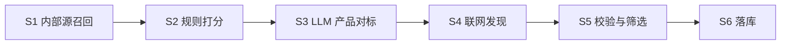

# 竞品分析 — 内部规则打分说明

> **适用范围**：竞品分析流水线 **S2 规则打分**（内部源候选），及与之衔接的进池、校验、落库阈值  
> **实现版本**：以当前代码为准  
> **代码索引**：`competitorAnalysisRunner.js`（`ruleScoreCandidate`）、`competitorMatchUtils.js`（相似度函数）、`competitorMatchRecall.js`（候选字段）  
> **关联文档**：[竞品分析应用说明.md](./竞品分析应用说明.md)

---

## 1. 文档目的

用户在「竞品分析说明」中看到的 **「规则24」** 等字样，表示该候选在 **S2 内部规则打分** 阶段得到的 **`internalScore`（内部规则分，0～100）**，**不是**「第 24 条业务规则」，也**不是**最终是否落库的综合分。

本文说明：

1. 规则分由哪三个维度、何种公式合成；
2. 各维度使用的字段与算法细节；
3. 规则分在后续 LLM 对标、校验、落库中的用途；
4. 与产品需求文档的差异。

---

## 2. 流水线位置



| 阶段 | 是否使用本文「规则分」 | 说明 |
|------|------------------------|------|
| S1 召回 | 否 | 从底层项目、融资事件池拉候选，合并去重 |
| **S2 规则打分** | **是** | 对每条内部候选计算 `tagScore` / `productScore` / `industryScore` → `internalScore` |
| S3 LLM 对标 | 间接 | 规则分 Top20 等进入对标池；对标结果为 `llmProductScore` |
| S4 联网发现 | 否 | 纯联网候选 `hasInternal=false`，规则分为 0 |
| S5～S6 | 间接 | 综合分融合规则维与 AI 维，决定落库 |

---

## 3. 打分对象与输入字段

### 3.1 分析主体（目标 `target`）

由 `buildTargetProfile` 构建，字段来源因主体类型略有不同（被投 / 投前），语义一致：

| 字段 | 含义 | 典型来源 |
|------|------|----------|
| `tags` | 企业标签数组 | `ai_industry_tags_*`、补录标签、就绪校验合并结果 |
| `product_intro` | 产品介绍（AI） | `ai_product_intro` |
| `qcc_intro_effective` | 有效企查查业务介绍 | `qcc_company_intro` 经 `qccCompanyIntroSanitizer` 清洗 |
| `industry_l1` / `industry_l2` | 国标行业一、二级 | 主体表 `industry_std_lv1/lv2`（有则参与行业维） |

规则打分时，**产品介绍维**将目标侧文本拼接为：

```text
introA = product_intro + "\n" + qcc_intro_effective   （空段自动省略）
```

### 3.2 候选（`cand`）

来自 S1 合并后的内部源记录：

| 字段 | 底层项目 `ipo_project` | 融资事件 `sourcing_financing_event` |
|------|------------------------|-------------------------------------|
| `tags` | `ai_industry_tags_*` | `ai_company_tags_*` |
| `product_intro` | `ai_product_intro` | `ai_product_intro` 或 `project_desc` |
| `qcc_intro` | 企查查介绍字段 | 企查查介绍字段 |
| `industry_l1/l2` | 常为 `null` | `industry_std_lv1/lv2` |
| `sources` | 含 `ipo_project` | 可含 `sourcing_financing_event` |

同一企业多源命中时，在召回阶段已合并 `sources`；只要含底层或融资源，`hasInternal = true`。

---

## 4. 内部规则分公式（核心）

对每条候选调用 `ruleScoreCandidate(target, cand)`：

### 4.1 三个子分（均为 0～100 整数）

| 维度 | 代码字段 | 权重 | 计算方式 |
|------|----------|------|----------|
| **标签** | `tagScore` | **35%** | 目标与候选标签集合的 **Jaccard 相似度 × 100**，四舍五入取整 |
| **产品/介绍** | `productScore` | **40%** | 目标 `introA` 与候选 `introB` 的 **字符 2-gram 重叠分 × 100**，四舍五入取整 |
| **行业** | `industryScore` | **25%** | 见 §4.2 |

### 4.2 行业分两种路径

**路径 A — 目标与候选均有 `industry_l1`：**

| 条件 | 加分 |
|------|------|
| `industry_l1` 完全相同 | **+50** |
| `industry_l2` 相似度 | `round(l2Similarity(L2目标, L2候选) × 50)` |

`l2Similarity` 规则：

- L2 字符串完全相同 → `1.0`
- 一方包含另一方 → `0.85`
- 否则：按 `/`、空格、`>` 切词后，对词集合做 Jaccard

**路径 B — 任一方缺少 `industry_l1`：**

```text
industryScore = round(jaccardSimilarity(目标.tags, 候选.tags) × 80)
```

> 底层项目池候选常无行业字段，大量候选走路径 B，行业维与标签维存在相关性，但权重在总分中仍独立加权。

### 4.3 加权合成

```text
internalScore = round(
  tagScore     × 0.35 +
  productScore × 0.40 +
  industryScore × 0.25
)
```

实现为 `weightedScore`：对各维 `value × weight` 求和后除以权重和（本场景权重和为 1.0）。

**输出字段：**

- `internalScore`：内部规则分（界面展示为「规则{N}」）
- `tagScore` / `productScore` / `industryScore`：三维子分（写入落库明细 `score_breakdown_json` 时可追溯）
- `hasInternal`：是否含底层/融资源

---

## 5. 子算法细则

### 5.1 标签 Jaccard（`jaccardSimilarity`）

1. 将标签数组元素 `trim`、转小写、去空；
2. 构造集合 A、B；
3. `相似度 = |A ∩ B| / |A ∪ B|`；
4. 若 A、B 均为空 → 相似度 `0`。

标签解析支持：

- JSON 数组；
- 对象形态（多键扁平合并）；
- 顿号/逗号分隔的展示字符串。

### 5.2 产品文本重叠（`textOverlapScore`）

输入：目标 `introA`、候选 `introB`（均已转小写）。

| 情况 | 返回值（0～1） |
|------|----------------|
| 任一侧为空 | `0` |
| 两段完全相同 | `1` |
| 较短段是较长段的子串，且较短段长度 ≥ 8 | `0.85` |
| 其他 | 较短段所有 **长度为 2 的字符片段（2-gram）** 在较长段中的命中比例 |

**说明**：该维度为 **字面/n-gram 重叠**，不做语义 embedding，也不调用外部「文本相似度 API」。

### 5.3 标签分与行业退化

- **标签分**始终使用目标与候选的 **标签集合** Jaccard；
- **行业分**在缺 L1 时退化为 **同一对标签** Jaccard × 80，因此缺行业时「行业维」与「标签维」数据同源，但计入总分时权重不同（35% vs 25%）。

---

## 6. 规则分排序与展示

S2 完成后：

1. 对全部内部候选计算 `internalScore`；
2. 按 `internalScore` **降序**排序；
3. 写入步骤日志 `S2_rule`，`detail.top` 取前 **10** 条供「竞品分析说明」展示。

展示格式示例：

```text
1. 某某有限公司（规则24；来源：底层项目）
```

含义：**内部规则分 = 24**，来源为 `ipo_project`（多源时展示为「底层项目、融资事件」等）。

---

## 7. 规则分的下游用途（非落库分）

规则分 **仅用于内部源筛选与进池**，**不等于** 最终竞品落库分。

### 7.1 进入 LLM 产品对标池（S3）

对标池为以下集合的 **并集去重**（按企业信用代码或公司名）：

| 通道 | 条件 |
|------|------|
| 规则分通道 | 规则分排序 **Top 20** |
| 标签分通道 | 按 `tagScore` 降序，取 `tagScore ≥ 22` 的候选，最多 **15** 条（与规则 Top 并集） |
| 掩模/光罩赛道加宽 | 若目标标签或介绍命中 `掩模|光罩|mask|photomask`：标签通道阈值降为 **≥16**，最多 **28** 条；并按名称/简介关键词再补充，上限 **28** |

环境变量：`COMPETITOR_LLM_GAP_MS`（默认 650ms）控制对标请求间隔。

### 7.2 进入竞品校验池（S5）

满足 **任一** 即可进入校验（与规则分相关的一条）：

| 条件 | 阈值 |
|------|------|
| 内部规则分 | `internalScore ≥ 45` |
| LLM 产品对标分 | `llmProductScore ≥ 80` |
| 纯联网源 | AI 分 ≥ 55 |
| 内部 + 联网合并 | 含 `ai_web` 且 AI 分 ≥ 55 |

### 7.3 最终落库综合分（与规则分的关系）

落库使用 `computeComprehensiveScore`，**不是** 规则分本身：

| 场景 | 综合分公式 | `score_mode` |
|------|------------|--------------|
| 仅联网源（无内部源） | 综合分 = AI 分 | `ai_only` |
| 有内部源，AI &lt; 80 | 内部 × **0.6** + AI × **0.4** | `internal_0.6_ai_0.4` |
| 有内部源，AI ≥ 80 | 内部 × **0.2** + AI × **0.8** | `internal_0.2_ai_0.8` |

**落库门槛：**

| 条件 | 阈值 |
|------|------|
| 默认 | 综合分 **≥ 60** |
| 高信任 LLM | AI ≥ 80 且校验为直接竞品（非上下游）时，综合分 **≥ 55** |

**等级（`confidence_grade`）：**

| 综合分 | 等级 |
|--------|------|
| ≥ 90 | S |
| ≥ 80 | A |
| ≥ 70 | B |
| ≥ 60 | C |
| &lt; 60 | 不落库 |

因此：**规则分 24 的候选仍可进入 LLM 对标（若在规则 Top20 内），但单靠规则分通常无法进入校验池（需 ≥45），更难以直接满足 60 分落库线**，除非后续 LLM 对标与校验显著提高 AI 维分数。

---

## 8. 计算示例

假设某候选：

| 子分 | 值 | 说明 |
|------|-----|------|
| tagScore | 20 | 标签略有交集 |
| productScore | 25 | 产品介绍字面重叠较弱 |
| industryScore | 30 | 无 L1，走标签 Jaccard×80 |

则：

```text
internalScore = round(20×0.35 + 25×0.40 + 30×0.25)
              = round(7 + 10 + 7.5)
              = round(24.5)
              = 25
```

若展示为 **「规则24」**，则三维子分组合略低于上例，整体仍属「与主体标签、文案字面相似度偏低」区间。

---

## 9. 与产品需求 / 其他分数的区分

| 概念 | 说明 |
|------|------|
| **内部规则分 `internalScore`** | 本文档；S2；Jaccard + 2-gram + 行业/标签 |
| **LLM 产品对标分 `llmProductScore`** | S3；大模型 JSON `similarity_score`；语义相似 |
| **校验分 `validation.validated_score`** | S5；大模型校验输出 |
| **综合分 `relevance_score`** | 落库字段；规则维与 AI 维融合 |
| 产品文档中的「阿里云关键词/文本相似度 API」 | **当前实现未调用**；内部产品维使用 `textOverlapScore` |

---

## 10. 可调参数与环境变量

| 名称 | 默认值 | 作用 |
|------|--------|------|
| `TOP_N_LLM_RULE` | 20 | 规则分进入 LLM 池人数 |
| `TOP_N_LLM_TAG` | 15 | 标签分补充进 LLM 池上限 |
| `TAG_LLM_MIN` | 22 | 标签分补充最低 tagScore |
| `TOP_N_LLM_TAG_NICHE` | 28 | 掩模/光罩赛道标签通道上限 |
| `TAG_LLM_MIN_NICHE` | 16 | 掩模/光罩赛道标签分阈值 |
| `VALIDATE_INTERNAL_MIN` | 45 | 规则分进入校验池下限 |
| `LLM_HIGH_TRUST_THRESHOLD` | 80 | 高信任 LLM，改变综合分权重 |
| `SCORE_THRESHOLD_PERSIST` | 60 | 默认落库综合分下限 |
| `COMPETITOR_LLM_GAP_MS` | 650 | LLM 请求间隔（毫秒） |

权重（35% / 40% / 25%）当前为代码常量，未暴露为环境变量或系统配置页。

---

## 11. 排障提示

| 现象 | 可能原因 |
|------|----------|
| 规则分整体偏低（10～30） | 主体与池内候选标签重合少；产品介绍/企查查文案差异大；多为字面匹配 |
| 多家规则分相同（如均为 24） | 三维取整后加权结果接近；排序次键为召回顺序 |
| 规则分高但最终无竞品 | 未过 S5 校验（非竞品/上下游）或综合分 &lt; 60 |
| 说明里只有「规则分」无「LLM分」 | 查看的是 S2 步骤摘要；S3 完成后才有对标分 |

**日志位置：**

- 表 `sourcing_competitor_run_step_log`，`step_code = 'S2_rule'`；
- 控制台 `[competitorRunner]` / `[competitorAi]`。

---

## 12. 代码索引

| 模块 | 路径 |
|------|------|
| 规则打分主逻辑 | `news/server/utils/竞品分析/competitorAnalysisRunner.js` → `ruleScoreCandidate` |
| 相似度与综合分 | `news/server/utils/竞品分析/competitorMatchUtils.js` |
| 内部源召回与候选字段 | `news/server/utils/竞品分析/competitorMatchRecall.js` |
| 说明文案格式化 | `news/server/utils/竞品分析/competitorAnalysisSummaryService.js` |

---

**文档维护**：若调整 `ruleScoreCandidate` 权重、阈值或相似度算法，请同步更新本文 §4～§7、§10。
