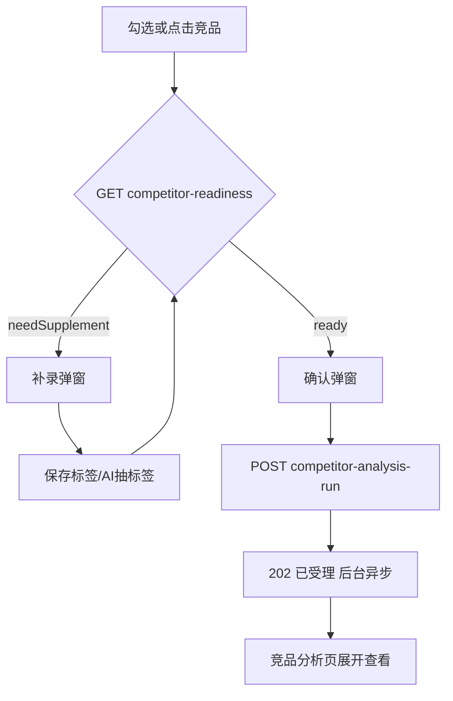
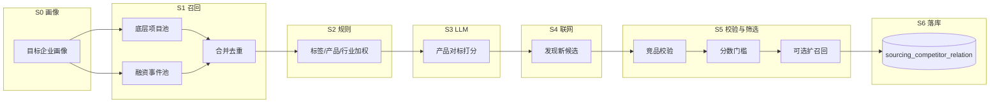
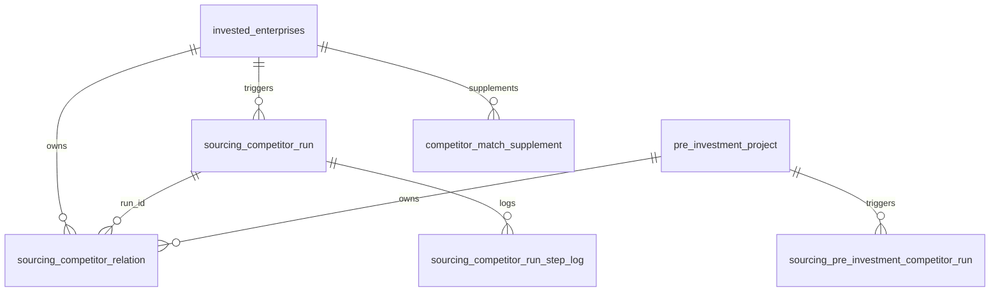

# 竞品分析应用说明

> **适用范围**：竞品分析应用 —「被投企业 × 竞品」与「投前项目 × 竞品」  
> **实现版本**：以当前代码为准（`news/server/utils/竞品分析/competitorAnalysisRunner.js` 等）  
> **关联需求**：[早期项目Sourcing产品需求文档.md](../项目sourcing/早期项目Sourcing产品需求文档.md) §3.5～§3.7

---

## 1. 功能概述

竞品分析用于：以**被投企业**或**投前项目**为分析主体，从**底层项目池**、**融资事件池**及**大模型联网**三路召回候选公司，经规则打分、LLM 对标、竞品校验后，将**综合置信度达标**的竞品写入关系表，并在前端以折叠列表展示。

**核心原则**：

| 原则 | 说明 |
|------|------|
| 异步执行 | 用户点击后接口立即返回 `202`，任务在 Node 进程内后台跑完 |
| 增量替换（按主体） | 同一被投/投前项目**每次成功跑完**会软删该主体下旧竞品关系，再写入本轮结果（非全库清空） |
| 低分不落库 | 综合分 &lt; 60（且无「高信任 LLM」例外）的候选**不写入** `sourcing_competitor_relation`，不出现在列表与导出 |
| 信息不足阻断 | 主体侧缺少产品介绍、有效企查查介绍、可用标签时，须先**补录业务信息**再发起分析 |

---

## 2. 菜单与页面入口

| 入口 | 路由 / 位置 | 作用 |
|------|-------------|------|
| **竞品分析** | `/dashboard/competitor-analysis/analysis` | Tab1：查看**未退出**的被投主行，展开已落库竞品明细；按项目编号年份筛选；导出 Excel |
| **被投企业** | 企业管理 → **竞品分析** → 被投企业列表 | **主操作入口**：单行「竞品」、左侧多选 +「竞品分析（多选）」、补录弹窗 |
| **投前项目** | 竞品分析 → 投前项目 | 单行「竞品分析」；算法与被投一致，主体为 `pre_investment_project` |

**权限**：

- 需具备**竞品分析**应用会员权限（`requireCompetitorAnalysisAccess`）。
- **非 admin**：仅可操作/查看**本人创建**的被投或投前主体（竞品补录、发起分析、查看关系、步骤日志）。
- **admin**：可操作全部主体；**竞品补录**、**自由文本抽标签**接口当前为 `requireAdmin`。
- 读取**融资事件池**另须用户具备**项目挖掘**应用权限（`canReadFinancingPoolForUser`）。

**三源召回（管理员）**：

- 路径：**系统配置** → Tab **竞品三源召回**（`GET/PUT /api/system/competitor-recall-source-config`）。
- 表 `competitor_recall_source_config`：`enable_ipo_project`、`enable_financing_event`、`enable_ai_web`（默认均为开启）。

**大模型配置**：

- 仅使用 `ai_model_config` 中 `application_type = competitor_analysis` 且 `usage_type = competitor_match` 的启用配置；**未配置则任务报错**，不回退 `project_sourcing_analysis`。
- 调用 DashScope **OpenAI 兼容** Chat 接口；联网发现支持 `enable_search`，不支持时自动降级为无联网单次请求。

---

## 3. 用户操作指南

### 3.1 发起分析（被投企业）



**步骤说明**：

1. 进入 **被投企业**列表（`data_app_name=竞品分析`，实体类型为被投）。
2. **单行**：操作列点击「竞品」；或 **批量**：左侧勾选多家企业 → 点击「竞品分析（多选）」（依次提交，遇第一家需补录则中断并打开弹窗）。
3. 系统调用 `GET /api/competitor-analysis/invested-enterprises/:id/competitor-readiness`：
   - 若 `needSupplement=true` → 弹出 **「竞品匹配 — 补充业务信息」**（见 §3.2），**不发起**任务。
   - 若 `ready=true` → 确认后调用 `POST .../competitor-analysis-run`，提示「已受理，后台召回与打分中」。
4. 稍后到 **竞品分析**页，展开对应被投行，或在该行点击「竞品分析说明」查看步骤与保留原因。

**限制**：

- `exit_status = 已退出` 的企业**不允许**发起分析。
- 批量为多选依次调用接口，**不支持**对全表一次跑批（无「全选跑全库」）。
- 前端确认文案中的「须命中内部源」为**过时提示**；现网实现允许**仅联网源**候选在 AI 分达标时落库（见 §5.4）。

### 3.2 信息不足 — 补录业务信息

当同时满足以下情况时判定为「信息不足」并阻断：

- 无 **产品介绍(AI)**（`ai_product_intro` 为空）；
- 且无 **有效企查查业务介绍**（经 `qccCompanyIntroSanitizer` 清洗后有效文本 &lt; 20 字，或为工商模版噪声）；
- 且无 **可用企业标签**（`ai_industry_tags_*` 与最近一次 **补录表** 合并后仍为空）。

**补录弹窗**（`CompetitorMatchSupplementModal`）用户须完成**至少一种**：

| 方式 | 要求 |
|------|------|
| 手工业务标签 | 逗号/顿号分隔，至少 1 个 |
| 自由文本 + AI 抽标签 | 粘贴业务/产品介绍（≤2000 字）→ 点击「AI 抽标签」→ 确认抽取结果后与标签一并保存 |

**接口**：

- `POST /api/competitor-analysis/competitor-match/extract-tags-from-narrative`（admin，仅抽标签不落库）
- `POST /api/competitor-analysis/invested-enterprises/:id/competitor-supplement`（admin，写入 `competitor_match_supplement`）

保存后再次发起分析时会合并补录标签进入目标画像。

### 3.3 查看结果（竞品分析页）

- 主表：项目挖掘下**未退出**被投企业（可按项目编号前 4 位年份筛选）。
- 展开行：懒加载 `GET /api/competitor-analysis/competitor-analysis/relations?invested_enterprise_id=`。
- 竞品列：名称、综合分、等级 S/A/B/C、数据源 Badge、产品介绍、标签、相关子基金等。
- **竞品分析说明**：`GET .../competitor-analysis/summary?invested_enterprise_id=` — 展示最近成功运行的步骤日志摘要 + 每条保留竞品的得分依据。

### 3.4 导出

- `POST /api/competitor-analysis/competitor-analysis/export`
- 支持按勾选被投 ID 导出，或管理员 **全量** 导出；可按年份过滤。
- 仅导出**已落库**且未删除的竞品关系。

### 3.5 投前项目

1. 在 **投前项目**页完成企查查同步与 **AI 取数**（产品介绍、标签）。
2. 点击「竞品分析」→ `POST /api/competitor-analysis/pre-investment-projects/:id/competitor-analysis-run`。
3. 就绪规则与被投类似（投前表字段）；结果写入同一张 `sourcing_competitor_relation`，`subject_type=pre_investment_project`。
4. 任务记录落在 `sourcing_pre_investment_competitor_run`（与被投 `sourcing_competitor_run` 分表）。

### 3.6 覆盖重跑（可选）

`POST .../competitor-analysis-run` 支持：

- `force=true` 且 `confirm_force=true`：发起前先将该主体下已有竞品关系**软删除**；
- 任务执行成功时 `persistRelations` 会再次归档旧关系后插入新结果。

普通重跑（不带 force）也会在**落库阶段**软删该主体旧关系后写入本轮结果，效果上为**按主体全量替换**竞品清单，而非在历史关系上追加版本。

### 3.7 被投企业定时同步与竞品数据保留

竞品与被投主体的关联字段为 **`invested_enterprise_id`**（非企业全称、非项目编号）。被投企业「竞品分析」应用下执行**硬删 + 全量重写**同步时：

1. **硬删前**：写入表 `competitor_analysis_sync_snapshot`（按统一社会信用代码 / 企业全称 / 项目简称匹配键备份运行记录、竞品关系、步骤日志、可比偏好、补录）。
2. **插入新被投后**：按匹配键将快照挂到**新 `id`**（生成新的 run/relation 主键）。
3. **去重合并**：删除重复被投行前，先将竞品数据 `UPDATE` 到保留行，避免级联删除。

管理员可在同步后手工恢复：`POST /api/competitor-analysis/competitor-analysis/restore-sync-snapshot`（body: `batch_id`, `creator_user_id`）。同步任务返回体含 `competitor_snapshot_batch_id`、`competitor_snapshot_restored`。

**库内仍有竞品数据但 `invested_enterprise_id` 为旧 id**（硬删被投后未级联删除等）：服务**启动后自动**按统一社会信用代码 / 企业全称 / 项目简称将 `sourcing_competitor_run`、`sourcing_competitor_relation` 等表的关联字段 `UPDATE` 到当前被投新 id（`COMPETITOR_RELINK_ON_STARTUP=0` 可关闭）。也可手动触发：

- `POST /api/competitor-analysis/competitor-analysis/relink-by-credit-code`（可选 `creator_user_id`；`dry_run=1` 仅预检）
- 匹配来源：`competitor_analysis_sync_snapshot` 中的 `match_type`/`match_key`，或孤儿竞品关系上的 `subject_display_name`

**已发生且库中无快照、无孤儿竞品行的历史丢失**：只能对被投企业重新发起竞品分析。

---

## 4. 系统运行逻辑（流水线）

任务由 `enqueueCompetitorAnalysisRun` 入队，`setImmediate` 异步执行 `executeCompetitorAnalysisRun`。全程向控制台与表 `sourcing_competitor_run_step_log` **双写**步骤日志。



### 4.1 S0 — 构建目标画像

从被投/投前行读取：

- 企业全称、统一社会信用代码、产品介绍(AI)、行业 L1/L2；
- 企查查介绍经 **清洗** 后的有效文本；
- 标签 = 行内 AI 标签 ∪ 最近一次 **补录标签**。

主体自身会从候选池中**排除**（同信用代码或同全称）。

### 4.2 S1 — 双源召回

| 数据源 | 表 | 范围与条件 |
|--------|-----|------------|
| **底层项目** | `ipo_project` | `data_app_id = 项目挖掘`；近 **3 年**内有更新；具备 AI 产品介绍或标签；单源上限约 3000 条 |
| **融资事件** | `sourcing_financing_event` | 近 **3 年**；按企业信用代码/公司名取 **`event_date` 最近一条** 代表事件；须具备 AI 产品介绍或标签 |

合并规则（`mergeRecalledCandidates`）：

- 同一竞品企业（信用代码优先，否则公司名）合并为一条；
- `sources` 可同时含 `ipo_project`、`sourcing_financing_event`；
- 多底层行命中时聚合 **子基金**（`ipo_sub`）列表，落库时写入 `sub_fund_names`。

### 4.3 S2 — 内部规则分（0～100）

对每条候选计算三维分后加权（`ruleScoreCandidate`）：

| 维度 | 权重 | 计算方式 |
|------|------|----------|
| **标签** | 35% | 目标与候选标签集合 **Jaccard 相似度** × 100 |
| **产品/介绍** | 40% | 目标（产品介绍 + 有效企查查）与候选文本的 **字符 n-gram 重叠分** × 100 |
| **行业** | 25% | L1 相等加 50 分 + L2 相似度 × 50；缺行业时退化为标签 Jaccard × 80 |

加权结果记为 **`internalScore`**；来源含底层或融资时 `hasInternal=true`。

> 产品需求中的「阿里云关键词/文本相似度 API」在当前实现中，内部规则分以 **Jaccard + 文本重叠** 为主；LLM 对标承担语义相似与联网发现。

### 4.4 S3 — LLM 产品对标

从规则分排序后的候选中构建 **对标池**（并集去重）：

- 规则分 **Top 20**；
- 标签分 Top（默认 ≥22 分取满 15 条；**掩模/光罩**等专业赛道放宽至 Top 28、阈值 16）；
- 掩模赛道另按名称/简介关键词补充（上限 28）。

对池内每条调用 `scorePairSimilarity`（JSON 输出 `similarity_score` 0～100），请求间隔默认 **650ms**（`COMPETITOR_LLM_GAP_MS`）。

### 4.5 S4 — 联网发现

`discoverWebCompetitors`：以目标画像 + 标签检索词 + 已召回公司名排除列表，让模型返回竞品 JSON 列表（≤20 条）。

- 与内部候选重名：合并 `ai_web` 源并抬高 AI 分；
- 纯新候选：`hasInternal=false`，`internalScore=0`，初分写入 `llmProductScore`（默认不低于 55 以便进入校验池）。

联网失败或模型不支持 `enable_search` 时记 **warn** 步骤，**不阻断**主流程。

### 4.6 S5 — 竞品校验与筛选

**校验池**入选条件（满足其一）：

- 内部规则分 ≥ 45；或
- LLM 对标分 ≥ 80；或
- 纯联网源且 AI 分 ≥ 55；或
- 内部 + 联网合并且 AI 分 ≥ 55。

对池内候选调用 `validateCandidate`，输出是否竞品、是否上下游、`validated_score` 等。

**落库前过滤**：

- 剔除 `is_competitor === false`；
- 剔除 `is_upstream_downstream === true`；
- 计算综合分后调用 `meetsPersistThreshold`（见 §5）。

**扩召回（默认开启）**：若通过条数 &lt; 3 或 S/A/B 不足 1 条，从放宽条件的候选中补充（`expanded: true` 写入明细 JSON），仍须过分数门槛。

### 4.7 S6 — 落库与展示字段补齐

1. `archivePriorCompetitorRelations`：软删该主体下旧关系；
2. 对每条待写入候选 `enrichCompetitorDisplayFields`：从底层/融资表补产品介绍、标签；不足时可选联网 AI 增强；
3. `INSERT sourcing_competitor_relation`；
4. 更新 `sourcing_competitor_run` / `sourcing_pre_investment_competitor_run` 状态为 `success` 或 `failed`。

---

## 5. 评分方式与等级

### 5.1 综合置信度（落库分 `relevance_score`）

记 **AI 分** = `llmProductScore` 或校验后的 `validated_score`（取可用者）。

| 场景 | 公式 | `score_mode` |
|------|------|----------------|
| **仅联网源**（无底层/融资命中） | 综合分 = AI 分 | `ai_only` |
| **有内部源**，AI &lt; 80 | 内部 × **0.6** + AI × **0.4** | `internal_0.6_ai_0.4` |
| **有内部源**，AI ≥ 80 | 内部 × **0.2** + AI × **0.8** | `internal_0.2_ai_0.8` |

### 5.2 等级（`confidence_grade`）

| 综合分 | 等级 |
|--------|------|
| ≥ 90 | **S** |
| ≥ 80 | **A** |
| ≥ 70 | **B** |
| ≥ 60 | **C** |
| &lt; 60 | 无等级（不落库） |

### 5.3 落库门槛

| 条件 | 阈值 |
|------|------|
| 默认 | 综合分 **≥ 60** |
| 高信任 LLM 路径 | AI 分 **≥ 80** 且校验为**直接竞品**（非上下游）时，综合分 **≥ 55** 亦可落库 |

低于门槛的候选仅在运行日志 / `S5_filter` 步骤明细中可见，**不出现在产品列表**。

### 5.4 评分明细（`score_breakdown_json`）

每条落库记录保存 JSON，便于前端「评分依据」展示，典型字段：

```json
{
  "internal_score": 72,
  "ai_score": 85,
  "final_score": 82,
  "score_mode": "internal_0.2_ai_0.8",
  "tag_score": 68,
  "product_score": 75,
  "industry_score": 50,
  "llm_product_score": 85,
  "validation": { "is_competitor": true, "validated_score": 84, "is_upstream_downstream": false },
  "expanded": false
}
```

### 5.5 数据源标记（`data_sources_json`）

| 值 | 含义 |
|----|------|
| `ipo_project` | 自项目挖掘底层项目池命中 |
| `sourcing_financing_event` | 自融资事件池命中 |
| `ai_web` | 大模型联网发现（可与上两者并存） |

---

## 6. 数据落库与表结构

### 6.1 表关系



### 6.2 主要表说明

| 表名 | 用途 |
|------|------|
| `sourcing_competitor_run` | 被投主体单次分析任务（`queued` → `running` → `success`/`failed`） |
| `sourcing_pre_investment_competitor_run` | 投前主体任务记录 |
| `sourcing_competitor_run_step_log` | 步骤 `S0_profile`～`S6_done` 及明细 JSON |
| `sourcing_competitor_relation` | **竞品明细唯一表**（被投 + 投前共用，`subject_type` 区分） |
| `competitor_match_supplement` | 被投竞品补录（用户标签、自由文本、AI 抽取标签） |

### 6.3 `sourcing_competitor_relation` 关键字段

| 字段 | 说明 |
|------|------|
| `subject_type` | `invested_enterprise` / `pre_investment_project` |
| `invested_enterprise_id` / `pre_investment_project_id` | 分析主体 |
| `run_id` / `pre_investment_run_id` | 关联本次任务 |
| `competitor_display_name` | 竞品展示名 |
| `unified_credit_code` | 竞品信用代码（有则用于去重） |
| `competitor_weak_key` | 无码时用展示名截断作弱键 |
| `relevance_score` | 综合置信度 0～100 |
| `confidence_grade` | S / A / B / C |
| `score_breakdown_json` | 评分明细 |
| `data_sources_json` | 数据源数组 |
| `competitor_product_intro` / `competitor_tags_*` | 展示用简介与标签 |
| `sub_fund_names` | 相关子基金（顿号分隔，多来自底层项目） |
| `financing_amount_text` | （兼容）单条融资金额摘要 |
| `financing_history_text` | **TEXT**：融资事件池匹配后的全轮次展示（日期-轮次-金额，多行） |
| `is_listed` | 是否上市：`1` 是 / `0` 否（LLM 不确定按 **否**） |
| `include_in_comparable` | 是否放入可比公司：`1` 是 / `0` 否（与偏好表同步） |

列表查询按 `relevance_score DESC` 排序；同一信用代码/公司名在接口层 **去重** 保留信息更丰富的一条。

### 6.4 竞品明细增强（信用代码 / 上市 / 融资 / 可比公司）

**适用范围**：投后「竞品分析」展开明细、投前「投前项目」展开明细（共用 `sourcing_competitor_relation`）。

#### 6.4.1 统一社会信用代码（境内）

| 规则 | 说明 |
|------|------|
| 境内认定 | 以 **18 位**统一社会信用代码为准；已有合法 18 位码视为境内主体 |
| 豁免 | **港澳台**、**外企英文名**竞品不强制必须有码（名称含港/澳/台等标识，或主体名为纯英文/拉丁字符为主） |
| 主路径 | 大模型联网发现、校验等环节返回 `unified_credit_code` |
| 兜底 | 境内仍无码时：用竞品展示名在 `sourcing_financing_event` **全表**匹配 `company_name`（见 6.4.2 名称规则），取命中记录的 `company_credit_code` 回填 |

#### 6.4.2 融资事件池名称匹配

用于**补信用代码**与**拼接融资列**，与召回阶段「近 3 年」窗口无关。

| 规则 | 说明 |
|------|------|
| 规范化 | 去中英文括号（括号内文字保留拼接）、**繁简统一**、`normalizeCompanyName`、**大小写统一**后相等匹配 |
| 公司类型 | **不区分**「有限公司」与「有限责任公司」等差异（由规范化与全名匹配承担） |
| 分子公司 | 去掉常见后缀：`分公司`、`分支机构`、`分店`、`办事处`、`代表处`、`经营部`、`支公司`、`子公司` 等后再匹配 |
| 一对多名 | 同一规范化键下的多条融资记录视为同一主体 |
| 展示 | 该主体在融资表中的**全部轮次**，按 `event_date` 降序；每行格式：`日期-轮次-金额`；缺字段用 **`【无】`**，例：`【无】-【无】-600万`；**每条一行**（换行分隔） |
| 存储 | `financing_history_text`（**TEXT**）；前端与「产品介绍」一致：**点击弹窗、可复制全文** |

#### 6.4.3 是否上市

| 规则 | 说明 |
|------|------|
| 列位置 | 「信用代码」之后 |
| 展示 | **是** / **否** |
| 认定范围 | **新三板**、**拟上市**、**港股（含仅 H 股）**等均算 **上市（是）** |
| LLM | 联网发现、竞品校验等 prompt 要求返回 `is_listed`；**不确定或未返回时按否（0）** |
| 存储 | `is_listed TINYINT(1)` |

#### 6.4.4 是否放入可比公司

| 规则 | 说明 |
|------|------|
| 列位置 | 「创建时间」之后；**Checkbox**，勾选=是，未勾选=否 |
| 作用域 | **分析主体 + 竞品**（`subject_type` + 被投/投前 id + `competitor_key`） |
| 重跑保留 | 每次分析仍按主体**软删旧明细再插入**；勾选状态存 **`sourcing_competitor_comparable_pref`**，仅对**本轮仍落库**的竞品按键恢复 `include_in_comparable` |
| 权限 | 具备竞品分析应用权限的用户均可操作，**不做创建人限制** |
| 审计 | 变更写入 **`data_change_log`**（`table_name=sourcing_competitor_comparable_pref`） |

`competitor_key` 与列表去重键一致：优先 `cc:{18位信用代码}`，否则 `name:{规范化公司名小写}`。

---

## 7. 主要 API 一览

| 方法 | 路径 | 说明 |
|------|------|------|
| GET | `/api/competitor-analysis/invested-enterprises/:id/competitor-readiness` | 就绪校验 |
| POST | `/api/competitor-analysis/invested-enterprises/:id/competitor-supplement` | 补录（admin） |
| POST | `/api/competitor-analysis/competitor-match/extract-tags-from-narrative` | 抽标签（admin） |
| POST | `/api/competitor-analysis/invested-enterprises/:id/competitor-analysis-run` | 发起被投分析 → **202** |
| POST | `/api/competitor-analysis/pre-investment-projects/:id/competitor-analysis-run` | 发起投前分析 → **202** |
| GET | `/api/competitor-analysis/competitor-analysis/relations` | 竞品明细列表 |
| PATCH | `/api/competitor-analysis/competitor-analysis/relations/:id/comparable` | 更新「是否放入可比公司」（写偏好表 + 审计日志） |
| GET | `/api/competitor-analysis/competitor-analysis/summary` | 分析说明（步骤 + 保留原因） |
| GET | `/api/competitor-analysis/competitor-analysis/runs/:runId/step-logs` | 步骤日志 |
| POST | `/api/competitor-analysis/competitor-analysis/export` | 导出 Excel |

---

## 8. 运维与排障

### 8.1 环境变量（可选）

| 变量 | 默认 | 作用 |
|------|------|------|
| `COMPETITOR_LLM_GAP_MS` | 650 | LLM 请求间隔，降低限流 |
| `COMPETITOR_LLM_TIMEOUT_MS` | 90000 | 非联网 LLM 超时 |
| `COMPETITOR_WEB_TIMEOUT_MS` | 180000 | 联网发现超时 |
| `COMPETITOR_WEB_NO_SEARCH_TIMEOUT_MS` | （见代码） | 降级无联网单次超时 |

### 8.2 常见问题

| 现象 | 可能原因 | 处理建议 |
|------|----------|----------|
| 点击竞品无反应 / 400 信息不足 | 缺 AI 产品介绍、标签与有效企查查 | 先 AI 取数或走补录弹窗 |
| 202 后长时间无竞品 | 任务失败或全部低于 60 分 | 查 `sourcing_competitor_run.message`、步骤日志 `S5_filter` |
| 联网步骤 warn | 模型不支持 `enable_search` 或超时 | 换支持联网的模型或调大超时 |
| 重跑后旧竞品消失 | 按主体**替换**落库设计 | 预期行为；**可比公司勾选**通过偏好表保留（仅仍入选竞品恢复） |
| 仅联网竞品出现 | `ai_only` 路径，内部池未命中但 AI 分高 | 正常；可加强底层/融资池数据 |

### 8.3 代码索引

| 模块 | 路径 |
|------|------|
| 流水线主逻辑 | `news/server/utils/竞品分析/competitorAnalysisRunner.js` |
| 公司名匹配 / 境内判定 | `news/server/utils/竞品分析/competitorCompanyMatch.js` |
| 融资池兜底与全轮次文案 | `news/server/utils/竞品分析/competitorFinancingResolve.js` |
| 可比公司勾选偏好 | `news/server/utils/竞品分析/competitorComparablePrefService.js` |
| 落库字段增强 | `news/server/utils/竞品分析/competitorRelationPersistEnhance.js` |
| 召回 | `news/server/utils/竞品分析/competitorMatchRecall.js` |
| 分数与等级 | `news/server/utils/竞品分析/competitorMatchUtils.js` |
| LLM 调用 | `news/server/utils/竞品分析/competitorAnalysisAi.js` |
| 就绪与补录 | `news/server/utils/竞品分析/competitorMatchReadinessService.js` |
| HTTP 路由 | `news/server/routes/竞品分析/competitorMatchRoutes.js` |
| 前端 — 竞品分析页 | `news/client/src/pages/竞品分析/ProjectSourcingCompetitorAnalysisPage.jsx` |
| 前端 — 投前竞品 | `news/client/src/pages/竞品分析/ProjectSourcingPreInvestmentPage.jsx` |
| 前端 — 竞品明细列 | `news/client/src/pages/竞品分析/competitorRelationColumns.jsx` |
| 前端 — 被投发起 | `news/client/src/pages/EnterpriseManagement.jsx` |

---

## 9. 与产品需求的差异说明（阅读时注意）

| 产品文档描述 | 当前实现 |
|--------------|----------|
| 阿里云关键词/文本相似度 API 占内部 40% | 内部产品维以 **文本重叠分** 为主；语义相似主要靠 **LLM 对标** |
| 内部候选池入池 ≥70 | 无单独 70 门槛；统一走规则分排序 + LLM 池 + 综合分 ≥60 落库 |
| 打新/相似度 80% 阈值 | 竞品分析**不走**打新通道；相似度逻辑见本文 §5 |
| 「非竞品」用户反馈全局降权 | **校验阶段**排除上下游/非竞品；用户反馈降权以需求为准，**需单独确认是否已上线** |

详细产品规则仍以 [早期项目Sourcing产品需求文档.md](../项目sourcing/早期项目Sourcing产品需求文档.md) 为基准；本文描述**现网行为**，便于操作与排障。

---

**文档维护**：功能变更时请同步更新 §4～§6 与「差异说明」表。
